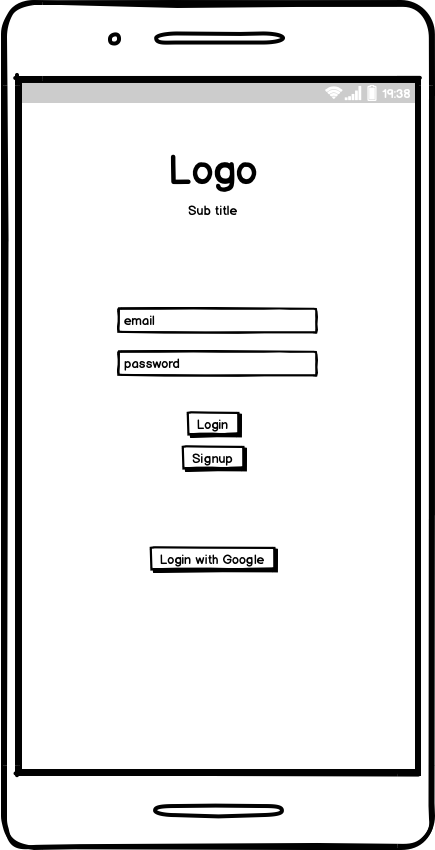
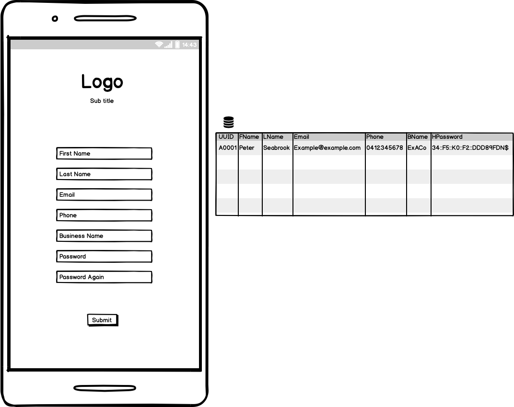
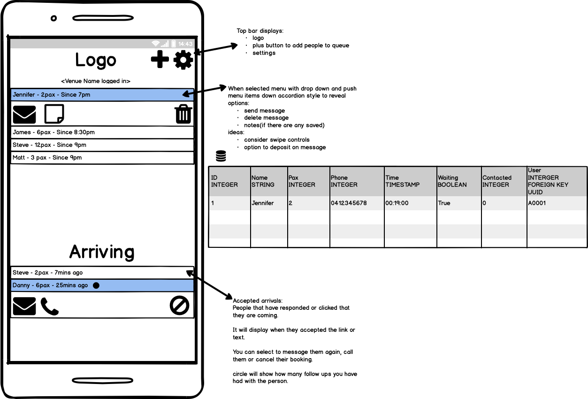
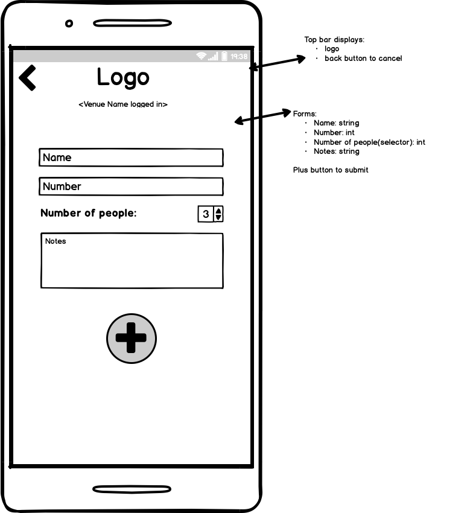
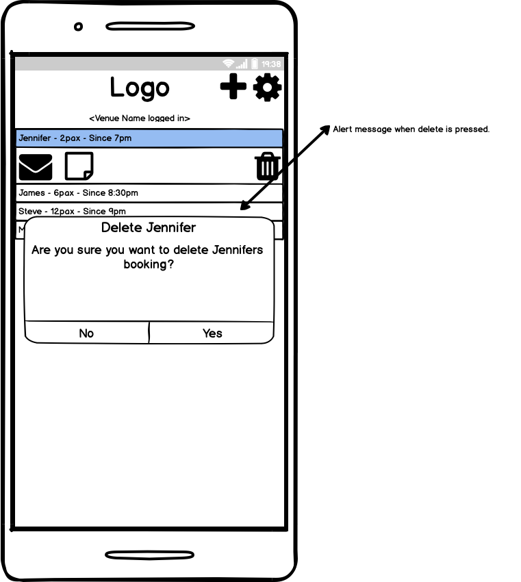
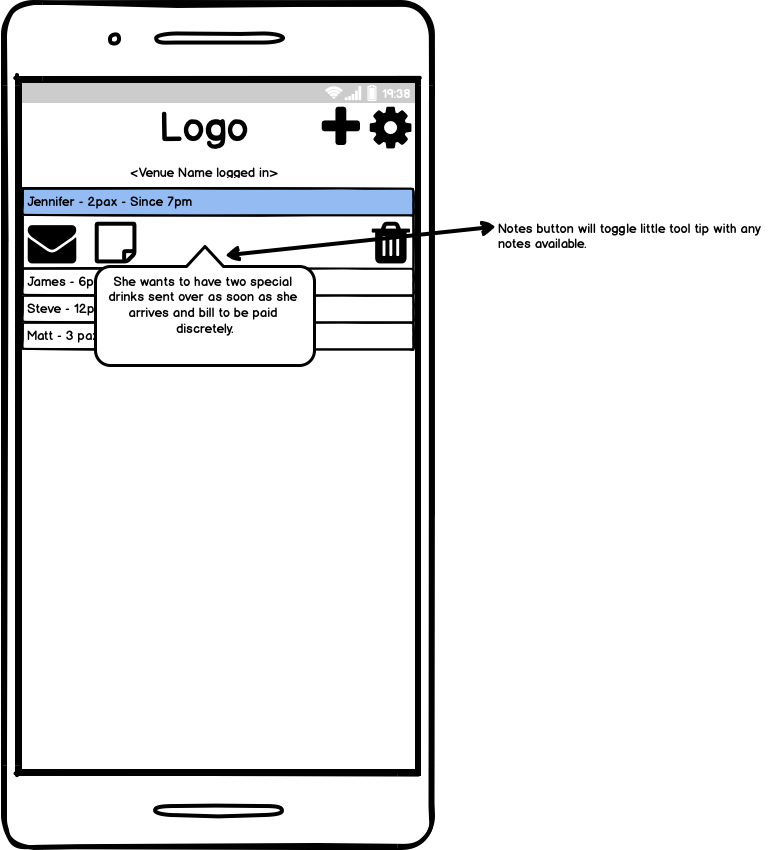
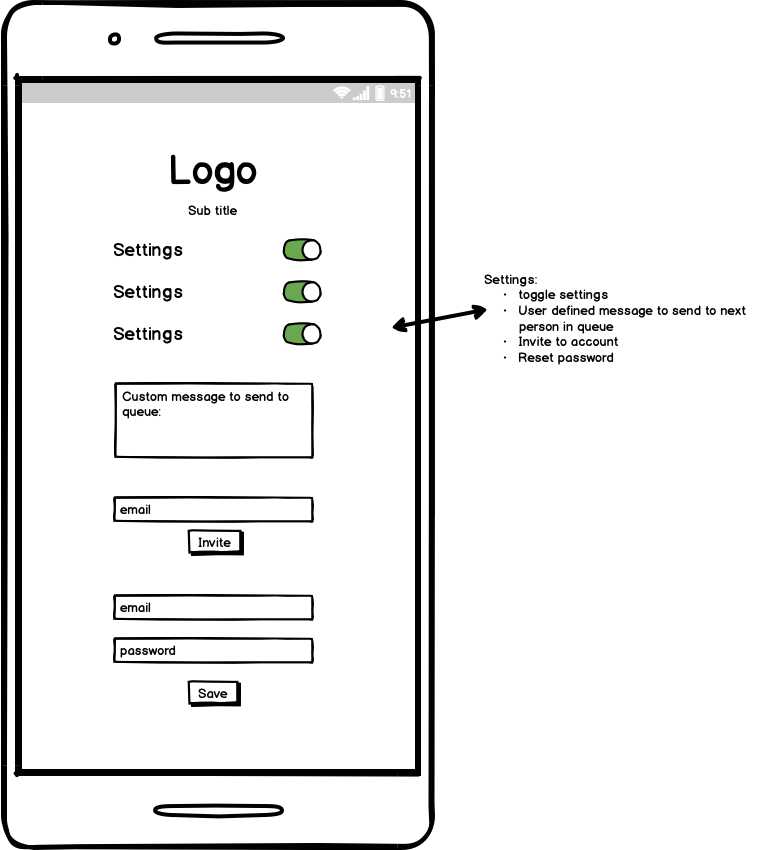

# Q.ly
Q.ly is a simple way to take quick bookings when your
venue is at capacity or you need an easy automated waiting line.

### Installation
Install and activate your virtual environment
```bash
git clone https://github.com/petelah/Q-ly.git
cd Q-ly
pip install -r requirements.txt
```

### Running
You will need to set your flask environment variables:
```bash
export FLASK_APP="run.py"
export FLASK_DEBUG="False"
```
Running with flask, the following command will make it viewable to computers 
on your network or the internet by browsing http://[your-network-ip]/:
```bash
flask run --host=0.0.0.0 --port=80
```
You may drop host and port if you like your default web address will be 
http://127.0.0.1:5000 which will only be viewable from your local machine.

### Development

#### CI/CD Pipeline
The pipeline constructed will push to a github test instance running Ubuntu latest, 
run tests and if passed it will push up to EC2 for production installation.

You will get an email notification once all production is complete and running 
without errors.


#### Wireframes









#### Workflow

Add flowchart here.